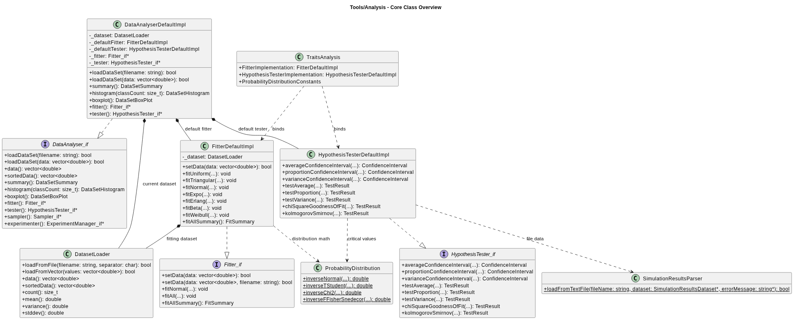
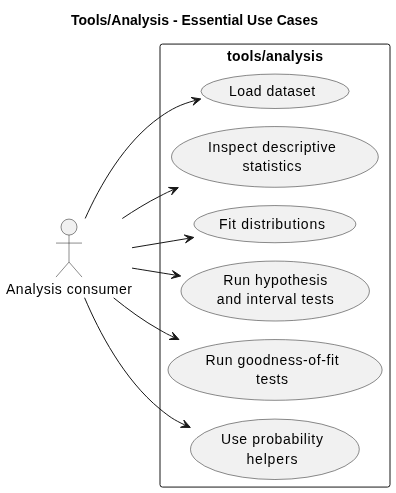
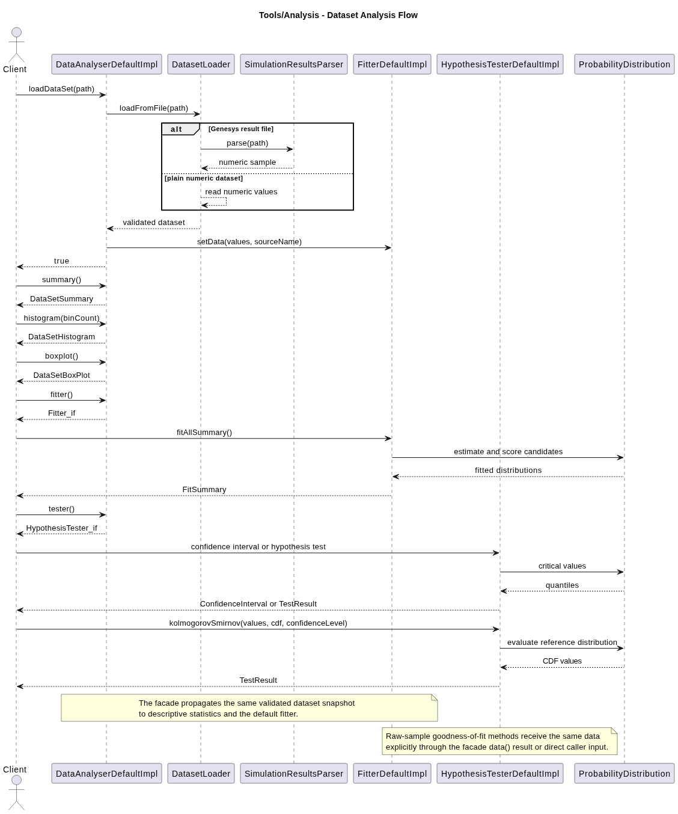
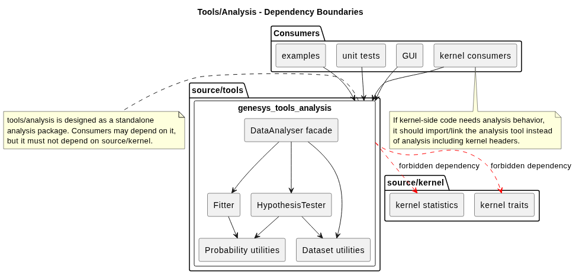

# Desenvolvimento de Componente de Simulação

## Ferramenta de Análise de Dados para o GenESyS

**Título do DCS:** Ferramenta de Análise de Dados para Ajuste de Distribuições e Inferência Paramétrica no GenESyS

**Grupo:** `11.3.2 - Foco em ajuste de distribuições e inferência paramétrica`

**Integrantes e matrículas:**

| Integrante | Matrícula |
| --- | --- |
| `Henrique Mateus Teodoro` | `23100472` |
| `Jonatan Felipe Hartmann` | `23104231` |
| `Rodrigo Schwartz` | `23100471` |

**Disciplina:** `INE5425 - Modelagem e Simulação`

**Professor:** `Rafael Luiz Cancian`

**Data considerada:** 2026-06-22

**Repositório/base de comparação:** branch `dev` comparada com `upstream/2026-1` do repositório `rlcancian/Genesys-Simulator`.

---

# 1. Resumo

Este DCS implementa e consolida uma ferramenta de análise de dados em C++ para o GenESyS. O componente foi desenvolvido como uma funcionalidade típica de simuladores de sistemas: tratamento e análise estatística de dados de entrada ou resultados de simulação.

A ferramenta está localizada principalmente em `source/tools/analysis` e é exposta pelo alvo CMake `genesys_tools_analysis`. O objetivo arquitetural principal foi tornar a análise de dados um pacote independente do `source/kernel`, de modo que aplicações, GUI, exemplos, testes ou consumidores do kernel possam depender da ferramenta, sem que a ferramenta dependa do kernel.

As funcionalidades consolidadas incluem:

- carregamento de datasets por arquivo e por memória;
- resumo estatístico mínimo;
- histogramas numéricos;
- estrutura numérica de boxplot;
- ajuste de distribuições;
- ranking estruturado de ajustes;
- intervalos de confiança;
- testes de hipóteses paramétricos;
- testes de aderência chi-square e Kolmogorov-Smirnov;
- exemplo executável de uso;
- testes unitários e de integração;
- documentação técnica, diagramas UML e registro de resultados.

# 2. Contexto do DCS

O requisito geral do DCS pede o projeto, desenvolvimento, teste e documentação de um componente de software em C++, vinculado ao simulador fornecido pelo professor. O componente desenvolvido aqui se enquadra na categoria de funcionalidade típica de simulador de sistemas: análise de dados, inferência estatística e ajuste de distribuições.

Os quatro primeiros critérios avaliativos foram tratados da seguinte forma:

| Critério DCS | Evidência nesta entrega |
| --- | --- |
| Atendimento a requisitos funcionais e casos de uso por testes unitários e de integração | Testes em `source/tests/unit/tools/analysis` e `source/tests/integration/tools/analysis`; documentação em `source/tests/README.md`. |
| Qualidade de software, engenharia e desempenho | Separação em alvo `genesys_tools_analysis`, fachada `DataAnalyserDefaultImpl`, desacoplamento do kernel, validação de entradas e uso de algoritmos estatísticos conhecidos. |
| Qualidade da documentação | READMEs em `source/tools`, `source/tools/analysis`, `source/tests`; diagramas renderizados; este relatório em `documentation/tools`. |
| Qualidade dos testes e comprovação de funcionamento | 95 testes unitários de tools, 2 testes de integração e exemplo executável com verificações determinísticas. |

O quinto critério, apresentação/simpósio, deve ser atendido por slides e vídeo preparados a partir deste relatório.

# 3. Comparação com `upstream/2026-1`

A branch `dev` foi comparada com `upstream/2026-1` após atualizar a referência remota com:

```sh
git fetch upstream 2026-1
```

Resumo do diff:

```text
69 files changed, 8073 insertions(+), 3375 deletions(-)
```

Principais áreas alteradas:

| Área | Principais mudanças |
| --- | --- |
| `source/tools/analysis` | Criação/consolidação do pacote principal de análise de dados. |
| `source/tools` | Criação do alvo `genesys_tools_analysis`, reorganização dos arquivos de análise, README e arquitetura. |
| `source/tests/unit/tools/analysis` | Testes unitários dedicados para dataset, fitter, hypothesis tester e fachada. |
| `source/tests/integration/tools/analysis` | Testes de integração ponta a ponta da ferramenta. |
| `examples` | Exemplo executável `analysis_tools_example.cpp` e datasets de exemplo. |
| `documentation` | Ajuste de Doxygen developer 2026 e notas históricas do Data Analyzer. |
| Build/CMake/Makefile | Preset de exemplos, alvo de análise, alvos de testes e atalhos de execução. |
| GUI/Qt `.pro` e consumidores | Ajustes de inclusão/link para o novo pacote de análise quando necessário. |

Commits principais da branch `dev` relacionados ao componente:

```text
feat: DatasetLoader and refactor fitter
refactor: move data analysis files into tools/analysis/ subdirectory
add tests for fitter, dataset loader and simulation results dataset
feat: consolidate analysis fitter and hypothesis tester defaults
feat: add goodness-of-fit tests to analysis tools
feat: resumo estatístico descritivo
feat: histogramas e boxplot
feat: ranking de distribuições no fitter
fix: chiSquareGoodnessOfFit
fix: garante que fitter e hypothesis usem o mesmo dataset
refactor: desacoplamento de ProbabilityDistribution
feat: diagrams
feat: integration tests
```

# 4. Casos de Uso Considerados

Os casos de uso foram definidos com foco no uso direto da ferramenta por código C++ e no uso indireto por aplicações do GenESyS.

| Caso de uso | Descrição | Status |
| --- | --- | --- |
| UC01 - Carregar dataset de arquivo | Usuário informa um arquivo numérico ou resultado de simulação para carregar observações. | Implementado |
| UC02 - Carregar dataset em memória | Usuário passa `std::vector<double>` diretamente para a fachada. | Implementado |
| UC03 - Obter resumo estatístico | Usuário consulta contagem, min, max, média, variância, desvio padrão e flag de negativos. | Implementado |
| UC04 - Obter histograma numérico | Usuário solicita classes/frequências para inspeção exploratória. | Implementado |
| UC05 - Obter boxplot numérico | Usuário solicita quartis, cercas, whiskers e outliers. | Implementado |
| UC06 - Ajustar distribuições | Usuário ajusta distribuições conhecidas ao dataset carregado. | Implementado |
| UC07 - Obter ranking de ajustes | Usuário recebe ranking estruturado das distribuições por erro. | Implementado |
| UC08 - Calcular intervalos de confiança | Usuário calcula ICs para média, proporção, variância, diferenças e razão de variâncias. | Implementado |
| UC09 - Executar testes paramétricos | Usuário testa médias, proporções e variâncias para uma ou duas populações. | Implementado |
| UC10 - Executar testes de aderência | Usuário executa chi-square e KS com CDF especificada. | Implementado |
| UC11 - Usar overloads baseados em arquivo | Usuário executa inferências diretamente a partir de arquivos. | Implementado |
| UC12 - Usar exemplo integrado | Usuário executa um exemplo completo da ferramenta. | Implementado |
| UC13 - Sampler e experimenter pela fachada | Mantidos como pontos de extensão futuros. | Fora do escopo atual |
| UC14 - `newDataSet` e `saveDataSet` | Mantidos por compatibilidade/roadmap. | Fora do escopo atual |

# 5. Arquitetura

## 5.1 Visão geral

A arquitetura foi reorganizada para centralizar o componente em `source/tools/analysis`. O ponto de entrada principal é `DataAnalyserDefaultImpl`, que implementa `DataAnalyser_if` e funciona como fachada da ferramenta.

Responsabilidades principais:

| Componente | Responsabilidade |
| --- | --- |
| `DataAnalyser_if` | Contrato público da fachada de análise. |
| `DataAnalyserDefaultImpl` | Carrega dataset, expõe estatísticas descritivas e fornece fitter/tester. |
| `DatasetLoader` | Carrega dados, valida observações e calcula estatísticas básicas. |
| `SimulationResultsDataset` / `SimulationResultsParser` | Leem formatos de resultado do GenESyS sem depender do kernel. |
| `Fitter_if` / `FitterDefaultImpl` | Ajustam distribuições e produzem ranking de aderência. |
| `HypothesisTester_if` / `HypothesisTesterDefaultImpl` | Calculam ICs, testes paramétricos e testes de aderência. |
| `ProbabilityDistributionBase` / `ProbabilityDistribution` | Funções matemáticas de densidade/massa, CDF auxiliar e quantis. |
| `TraitsAnalysis` | Centraliza os tipos padrão usados pela ferramenta. |

## 5.2 Diagramas

### Diagrama de classes



### Diagrama de casos de uso



### Diagrama de sequência do fluxo principal



### Diagrama de fronteiras de dependência



## 5.3 Decisão de desacoplamento do kernel

Antes da consolidação, parte da lógica de análise e inferência se misturava com dependências de `kernel/statistics`, `StatisticsDataFile_if`, `CollectorDatafile_if` ou traits do kernel. A entrega removeu esse acoplamento do pacote de análise.

Regra arquitetural adotada:

```text
applications / GUI / tests / kernel consumers
    -> genesys_tools_analysis
    -> helpers locais de analysis
```

Assim, se um módulo do kernel, GUI ou aplicação precisar de análise estatística, ele importa/linka `genesys_tools_analysis`. A dependência inversa não deve existir.

# 6. Refatorações, Adições e Remoções

## 6.1 Refatorado

- Arquivos de análise foram movidos de `source/tools` para `source/tools/analysis`.
- `TraitsTools.h` foi consolidado como `TraitsAnalysis.h`.
- `ProbabilityDistribution` e `ProbabilityDistributionBase` foram movidos para `tools/analysis`, mantendo a API matemática local ao pacote.
- `HypothesisTesterDefaultImpl1` foi substituído/consolidado por `HypothesisTesterDefaultImpl`.
- `FitterDefaultImpl` passou a usar `Fitter_if` e dataset em memória/arquivo de forma alinhada.
- Os overloads baseados em arquivo do `HypothesisTesterDefaultImpl` passaram a usar parser/loader locais da análise.

## 6.2 Adicionado

- Alvo CMake `genesys_tools_analysis`.
- `DataAnalyserDefaultImpl` funcional.
- `DatasetLoader`.
- `SimulationResultsDataset` e `SimulationResultsParser`.
- Entrada por memória na fachada.
- `DataSetSummary`, `DataSetHistogram`, `HistogramBin`, `DataSetBoxPlot`.
- `FittingResult`, `FittedParameter`, `FitSummary`.
- `fitAllSummary()`.
- Testes chi-square e Kolmogorov-Smirnov.
- Testes unitários dedicados de `tools/analysis`.
- Testes de integração dedicados de `tools/analysis`.
- Exemplo executável analítico em `examples/analysis_tools_example.cpp`.
- Exemplo executável de simulação e análise em `examples/simulation_analysis_example.cpp`.
- Datasets de exemplo.
- READMEs e diagramas da ferramenta.

## 6.3 Removido ou substituído

- Implementações antigas soltas em `source/tools` foram removidas ou movidas para `source/tools/analysis`.
- Dependências diretas de `source/kernel` foram retiradas da ferramenta de análise.
- A ferramenta deixou de depender de coletores estatísticos do kernel para operar em arquivos/datasets.

## 6.4 Mantido como fora de escopo

Os seguintes pontos permanecem na interface por compatibilidade e roadmap, mas não fazem parte da entrega funcional atual:

- `DataAnalyserDefaultImpl::newDataSet`;
- `DataAnalyserDefaultImpl::saveDataSet`;
- `DataAnalyserDefaultImpl::sampler`;
- `DataAnalyserDefaultImpl::experimenter`.

Quando não há colaborador externo injetado, esses caminhos lançam `std::runtime_error` indicando que ainda são escopo futuro.

# 7. Decisões de Implementação

## 7.1 Fachada como ponto de entrada

Foi adotada uma fachada (`DataAnalyserDefaultImpl`) para simplificar o uso direto por código C++ e por futuros consumidores GUI. O usuário pode criar:

```cpp
DataAnalyserDefaultImpl analyser;
```

sem precisar instanciar manualmente o fitter ou o tester padrão. Esses defaults são definidos por `TraitsAnalysis`.

## 7.2 Dataset único e consistente

A fachada mantém uma cópia validada do dataset em `DatasetLoader`. Ao carregar um dataset, a mesma amostra é propagada para o `FitterDefaultImpl`. Isso evita que summary, histograma, boxplot e fitting usem bases diferentes.

Para testes de aderência que exigem dados crus, a recomendação documentada é passar `analyser.data()` ao `HypothesisTesterDefaultImpl`.

## 7.3 APIs estruturadas

Foram adicionadas estruturas de retorno em vez de depender apenas de ponteiros de saída:

- `DataSetSummary`;
- `DataSetHistogram`;
- `DataSetBoxPlot`;
- `FittingResult`;
- `FitSummary`;
- `TestResult`;
- `GoodnessOfFitDetails`.

As assinaturas legadas baseadas em ponteiros foram preservadas quando necessário por compatibilidade.

## 7.4 Validação explícita

A implementação valida:

- datasets vazios;
- valores não finitos;
- níveis de confiança fora de `(0, 1)`;
- tamanhos amostrais inválidos;
- frequências esperadas inválidas;
- CDFs inválidas;
- graus de liberdade não positivos.

Falhas de carregamento retornam `false` na fachada. Falhas matemáticas de uso incorreto lançam `std::invalid_argument` quando apropriado.

# 8. Algoritmos e Desempenho

## 8.0 Matriz de Rastreabilidade por Caso de Uso

Esta matriz enumera os algoritmos efetivamente usados na implementação. Ela
separa algoritmos estatísticos dos procedimentos de apoio necessários para
executá-los, como ordenação, integração numérica e busca de quantis.

| Caso de uso | Métodos da ferramenta | Algoritmos, estatísticas e políticas empregados |
| --- | --- | --- |
| UC01 - Carregar dataset de arquivo | `loadDataSet(filename)`, `DatasetLoader::loadFromFile` | Parsing por `strtod`; validação de finitude com `std::isfinite`; texto delimitado/espaços e binário de `double`. Linhas de metadados iniciadas por `#`, como as de `Record`, são ignoradas. Não há inferência estatística nesta etapa. |
| UC02 - Carregar dataset em memória | `loadDataSet(vector)`, `DatasetLoader::loadFromVector` | Varredura linear para validar valores finitos e cópia do vetor; em seguida executa a mesma pré-computação estatística do UC01. |
| UC03 - Resumo estatístico | `summary()` | Média, variância amostral, desvio padrão, mínimo e máximo por algoritmo online de **Welford**; variância dividida por `n - 1`; flag de negativos por comparação com o mínimo. |
| UC04 - Histograma numérico | `histogram(k)` | Classes de largura igual no intervalo `[min, max]`; contagem por índice aritmético; frequência relativa `f_i/n`. Com `k=0`, usa **regra de Sturges**: `ceil(1 + 3.322 log10(n))`. |
| UC05 - Boxplot numérico | `boxplot()` | Quartis e mediana por interpolação linear na amostra ordenada, com posição `p(n-1)`; IQR `Q3-Q1`; cercas de **Tukey** `Q1-1.5IQR` e `Q3+1.5IQR`; whiskers são os valores extremos dentro das cercas. |
| UC06 - Ajustar distribuições | `fitUniform`, `fitTriangular`, `fitNormal`, `fitExpo`, `fitErlang`, `fitBeta`, `fitWeibull` | Estimadores por estatísticas amostrais, método dos momentos e inversão numérica, detalhados na Seção 8.3. Todos os candidatos são avaliados pelo SSE EDF/CDF com posições de **Hazen**. |
| UC07 - Ranking de ajustes | `fitAllSummary()` | Executa os sete ajustes, marca falhas, e usa `std::stable_sort` por sucesso e SSE crescente. O ranking não é um teste formal de aderência. |
| UC08 - Intervalos de confiança | Métodos `*ConfidenceInterval` | IC t-Student para média; normal para proporções; correção de população finita; chi-square para variância; F para razão de variâncias; pooled t ou **Welch-Satterthwaite** para diferença de médias. |
| UC09 - Testes paramétricos | Métodos `testAverage`, `testProportion`, `testVariance` | Estatísticas t, z, chi-square e F; p-valor uni/bilateral pela CDF correspondente; teste z de duas proporções usa proporção combinada; teste de médias escolhe pooled/Welch pela compatibilidade do IC da razão de variâncias com 1. |
| UC10 - Testes de aderência | `chiSquareGoodnessOfFit`, `kolmogorovSmirnov` | Pearson chi-square com frequências esperadas por CDF, agrupamento sequencial de classes de baixa frequência esperada e `df=k-1-p`; KS de uma amostra com `D=max(D+,D-)` e série assintótica clássica para p-valor. |
| UC11 - Inferência baseada em arquivo | Overloads de IC, testes e KS | Reaplica os algoritmos de UC08--UC10 após converter o arquivo em `DatasetLoader`; prioriza parser de resultados GenESyS para preservar apenas os valores observados. |
| UC12 - Exemplos executáveis | `analysis_tools_example`, `simulation_analysis_example` | Demonstra os algoritmos anteriores. O exemplo de simulação usa chegadas exponenciais `expo(5)` e gera medições normais `norm(50,9.83)` em um `Record`, que são então analisadas pela ferramenta. |
| UC13 - Sampler/experimenter | `sampler()`, `experimenter()` | Não implementado; não há algoritmo estatístico associado neste escopo. |
| UC14 - Novo/salvar dataset | `newDataSet()`, `saveDataSet()` | Não implementado; são ganchos de ciclo de vida/persistência, sem algoritmo estatístico associado. |

### Procedimentos numéricos transversais

Vários casos de uso dependem de quantis e CDFs que não possuem uma rotina
fechada única no pacote. A implementação usa os seguintes procedimentos:

| Necessidade | Procedimento implementado | Uso |
| --- | --- | --- |
| Quantil normal | Aproximação racional de **Peter J. Acklam** | Quantis z de ICs/testes e normal inversa pública. |
| CDF normal | Função erro complementar `erfc` | p-valores de testes z e CDF normal do fitting. |
| CDF chi-square, t e F no `HypothesisTester` | Integração composta de **Simpson 1/3** por `SolverDefaultImpl1`, com precisão `1e-6` e até 10.000 passos; chi-square possui atalhos fechados para `df=1` e `df=2`. | p-valores de testes de variância, média e razão de variâncias, além de chi-square. |
| CDF chi-square, t e F no módulo de quantis | Regra composta do **ponto médio**, com 8.192 subintervalos configurados em `TraitsAnalysis`. | CDFs usadas pela inversão de quantis. |
| Quantis chi-square, t e F | Expansão de intervalo seguida de **bisseção**; tolerâncias e limites de iteração centralizados em `TraitsAnalysis`. | Limites críticos e ICs. |
| Cache de quantis | `std::map` indexado pelos parâmetros e probabilidade. | Evita recalcular integrações/bisseções repetidas. |
| Função gamma | `std::tgamma`; função beta por relação `B(a,b)=Gamma(a)Gamma(b)/Gamma(a+b)`. | PDFs de beta, gamma, t, chi-square, F e escala Weibull. |

Os limites numéricos devem ser considerados ao interpretar resultados muito
extremos de cauda. Os testes unitários com valores tabelados cobrem as regiões
usuais de uso didático da ferramenta.

## 8.1 Carregamento e estatísticas

`DatasetLoader` carrega dados de texto delimitado, texto separado por espaços e arquivo binário de `double`.

Estatísticas básicas são calculadas em uma única passada usando acumulação incremental para média e variância amostral. A variância usa acumulação do tipo Welford, reduzindo perda numérica em relação a uma fórmula ingênua baseada em soma dos quadrados.

| Operação | Algoritmo | Complexidade |
| --- | --- | --- |
| Validação de dados | Varredura linear e checagem `std::isfinite` | O(n) |
| Média/variância/min/max | Passada única com acumulação incremental | O(n) |
| Dados ordenados | `std::sort` | O(n log n) |

O custo dominante do carregamento é a ordenação, necessária para percentis, boxplot, SSE por EDF/CDF e testes KS.

## 8.2 Resumo, histograma e boxplot

| Método | Algoritmo | Complexidade |
| --- | --- | --- |
| `summary()` | Retorna valores pré-computados pelo loader | O(1) |
| `histogram(k)` | Cria `k` classes e varre a amostra contando frequências | O(n + k) |
| `histogram(0)` | Usa regra de Sturges: `ceil(1 + 3.322 log10(n))` | O(n + k) |
| `boxplot()` | Percentis por interpolação linear sobre amostra ordenada; outliers por regra 1.5 IQR | O(n) após ordenação |

O boxplot retorna quartis, mediana, IQR, cercas, whiskers e outliers, sem depender de GUI.

## 8.3 Ajuste de distribuições

O critério de ranking usa erro quadrático entre CDF teórica e posição empírica de Hazen:

```text
SSE = sum_i (F(x_i) - p_i)^2
p_i = (i + 0.5) / n
```

Distribuições consideradas:

| Distribuição | Estimador/algoritmo implementado | Parâmetros produzidos |
| --- | --- | --- |
| Uniforme | Estimadores de extremos da amostra, equivalentes aos limites de suporte usados pelo MLE para uniforme contínua. | `a=min(x)`, `b=max(x)`. |
| Triangular | Método dos momentos com extremos amostrais. | `a=min(x)`, `b=max(x)`, `modo=3*mean-a-b`; a moda é limitada ao interior de `[a,b]` para manter CDF válida. |
| Normal | Estatísticas amostrais pré-computadas. | `mu=mean`, `sigma=stddev` com variância amostral de Welford. |
| Exponencial | MLE para a parametrização por escala/média. | `mean=mean(x)`; dados negativos ou média não positiva invalidam o ajuste. |
| Erlang | Método dos momentos. | `m=round(mean^2/variance)`, limitado a `m>=1`; `scale=mean/m`. A CDF usa a soma finita da Erlang inteira. |
| Beta escalada | Método dos momentos após normalizar `y=(x-min)/(max-min)` e limitar `y` a `(epsilon,1-epsilon)`. | `alpha=m((m(1-m)/v)-1)`, `beta=(1-m)((m(1-m)/v)-1)`, mais limites `min/max` originais. |
| Weibull | Casamento do coeficiente de variação com a expressão teórica, resolvido por bisseção. | Resolve `Gamma(1+2/k)/Gamma(1+1/k)^2 - 1 - CV^2 = 0` para a forma `k`; escala `lambda=mean/Gamma(1+1/k)`. |

Para beta escalada, a CDF é obtida por integração numérica de Simpson 1/3 da
PDF beta normalizada. Para Weibull, a CDF é fechada:

```text
F(x) = 1 - exp(-(x/lambda)^k), para x >= 0
```

`fitAllSummary()` executa todos os candidatos, descarta ajustes inválidos por `success=false`, ordena por SSE e retorna o melhor ajuste e o ranking completo.

Complexidade:

- cada avaliação de SSE custa O(n);
- `fitAllSummary()` usa número fixo de distribuições, então é O(n) após dataset carregado/ordenado;
- beta escalada e Weibull incluem passos numéricos adicionais:
  - beta CDF usa integração numérica;
  - Weibull forma usa bisseção com limite fixo de iterações.

Como o número de distribuições e iterações é limitado por constantes, o comportamento é adequado para datasets de tamanho moderado em uso didático/simulação.

## 8.4 Intervalos e testes paramétricos

`HypothesisTesterDefaultImpl` implementa inferência clássica:

| Método | Distribuição/estatística |
| --- | --- |
| IC de média | t-Student |
| IC de proporção | Normal aproximada |
| IC de proporção com população finita | Normal com correção finita |
| IC de variância | Chi-square |
| IC de diferença de médias | t pooled ou Welch |
| IC de diferença de proporções | Normal aproximada |
| IC de razão de variâncias | Fisher-Snedecor F |
| Teste de média | t-Student |
| Teste de proporção | Normal aproximada |
| Teste de variância | Chi-square |
| Testes de duas populações | t, normal ou F conforme parâmetro |

As estatísticas e erros-padrão usados são os seguintes:

| Operação | Estatística/intervalo implementado |
| --- | --- |
| IC/teste de uma média | `t=(xbar-mu0)/(s/sqrt(n))`; IC `xbar +- t_(1-alpha/2,n-1)s/sqrt(n)`. |
| Planejamento amostral da média | `n=ceil((z_(1-alpha/2)s/e0)^2)`. |
| IC/teste de uma proporção | Aproximação normal: `z=(phat-p0)/sqrt(p0(1-p0)/n)` e IC `phat +- z_(1-alpha/2)sqrt(phat(1-phat)/n)`. |
| IC de proporção finita | Multiplica o erro-padrão por `sqrt((N-n)/(N-1))`. |
| IC/teste de uma variância | `chi2=(n-1)s^2/sigma0^2`; IC pelos quantis chi-square de `n-1` graus de liberdade. |
| Diferença de médias pooled | `t=(xbar1-xbar2)/sqrt(sp^2(1/n1+1/n2))`, com `sp^2=((n1-1)s1^2+(n2-1)s2^2)/(n1+n2-2)`. |
| Diferença de médias Welch | `t=(xbar1-xbar2)/sqrt(s1^2/n1+s2^2/n2)`; graus de liberdade pela fórmula de Welch-Satterthwaite. |
| Diferença de proporções | IC usa erros não combinados; teste usa proporção combinada `pbar=(x1+x2)/(n1+n2)`. |
| Razão/teste de variâncias | `F=s1^2/s2^2`, com graus de liberdade `n1-1` e `n2-1`. |

Nos testes paramétricos, hipóteses bilaterais usam
`2*min(F_T(t), 1-F_T(t))` ou a CDF equivalente da estatística; hipóteses
unilaterais usam a cauda compatível com `LESS_THAN` ou `GREATER_THAN`.

Para diferença de médias, a política implementada é:

- usar t pooled quando a razão de variâncias indicar compatibilidade com 1;
- usar Welch quando as variâncias forem consideradas incompatíveis.

## 8.5 Chi-square goodness-of-fit

Há três formas principais:

- frequências observadas e esperadas diretamente;
- amostra crua + CDF + número automático de classes;
- amostra crua + CDF + limites de classes explícitos.

A partir de amostra crua:

1. as classes são definidas automaticamente ou por limites explícitos;
2. as frequências observadas são contadas;
3. as frequências esperadas são calculadas pela CDF informada;
4. classes adjacentes são agrupadas até atingir `minExpectedFrequency`;
5. os graus de liberdade são calculados por:

```text
df = effectiveClasses - 1 - estimatedParameters
```

A estatística de Pearson implementada é:

```text
X^2 = sum_i (O_i - E_i)^2 / E_i
```

Para dados crus, cada frequência esperada é calculada por
`E_i=n*(F(b_i)-F(a_i))/P(a_0 <= X <= b_k)`. Essa normalização preserva a
comparação mesmo quando os limites explícitos de classe não cobrem toda a
cauda teórica. O agrupamento é sequencial: acumula classes adjacentes até
atingir `minExpectedFrequency`; se a última classe ainda ficar abaixo do
limiar, ela é fundida à anterior.

Complexidade: O(n + k), onde `n` é o tamanho da amostra e `k` é o número de classes iniciais.

## 8.6 Kolmogorov-Smirnov

O KS ordena a amostra e calcula a maior diferença entre a CDF empírica e a CDF teórica informada.

Para cada observação ordenada `x_(i)`, a implementação calcula:

```text
D+ = max_i (i/n - F(x_(i)))
D- = max_i (F(x_(i)) - (i-1)/n)
D  = max(D+, D-)
```

O limite crítico usado é a aproximação assintótica
`sqrt(-0.5*ln(alpha/2)/n)`. O p-valor usa a série alternada clássica com
correção finita `lambda=(sqrt(n)+0.12+0.11/sqrt(n))*D`, truncada quando o
termo fica menor que `1e-12` ou após 100 termos.

Complexidade:

- O(n log n) se a amostra ainda não estiver ordenada;
- O(n) para varrer e calcular a estatística.

Observação importante: o p-value implementado é a aproximação clássica do KS para CDF completamente especificada. Quando os parâmetros da distribuição são estimados da própria amostra, o p-value deve ser tratado como diagnóstico, pois não há correção de Lilliefors, bootstrap ou Monte Carlo.

## 8.7 Probabilidade e quantis

`ProbabilityDistributionBase` fornece densidades/massas para distribuições conhecidas. `ProbabilityDistribution` fornece inversas/quantis usados em ICs e testes.

As funções de probabilidade implementadas usam as fórmulas fechadas usuais:

| Família | Função implementada | Base matemática |
| --- | --- | --- |
| Beta | `beta` | PDF beta por funções gamma. |
| Chi-square | `chi2` | PDF chi-square por potência, exponencial e gamma. |
| Erlang/Gamma | `erlang`, `gamma` | PDFs gamma com forma e escala; Erlang é o caso de forma inteira. |
| Exponencial | `exponential` | PDF exponencial parametrizada pela taxa usada pelo helper legado. |
| Fisher-Snedecor | `fisherSnedecor` | PDF F por função beta. |
| Normal/Lognormal | `normal`, `logNormal` | PDFs fechadas com exponencial quadrática. |
| Poisson | `poisson` | PMF `mean^x exp(-mean)/x!`. |
| Triangular/Uniforme | `triangular`, `uniform` | PDFs por partes. |
| t-Student | `tStudent` | PDF por gamma e graus de liberdade. |
| Weibull | `weibull` | PDF de forma/escala. |

Essas funções são usadas tanto diretamente pelo exemplo quanto indiretamente
pelas integrações de CDF, cálculo de quantis e avaliação de ajustes.

Decisões relevantes:

- normal inversa usa aproximação racional de Peter J. Acklam;
- chi-square, t-Student e Fisher-Snedecor usam CDF numérica e bisseção para
  os quantis; o tipo de integração depende do consumidor, conforme matriz da
  Seção 8.0;
- quantis usam cache interno para evitar recomputação;
- constantes numéricas foram centralizadas em `TraitsAnalysis<ProbabilityDistribution>`.

# 9. Build, CMake e Makefile

## 9.1 CMake

O componente é exposto por:

```text
genesys_tools_analysis
```

O alvo é definido em `source/tools/CMakeLists.txt` e contém apenas o pacote de análise e utilitários locais necessários. Ele deve compilar sem linkar `genesys_kernel_*`.

Também foi adicionado:

- opção `GENESYS_BUILD_EXAMPLES`;
- preset `examples`;
- executável `genesys_examples_analysis_tools`;
- executável `genesys_examples_simulation_analysis`;
- alvo agregador `genesys_examples`;
- alvo `genesys_tools_unit_tests`;
- alvo `genesys_tools_integration_tests`.

O professor pode abrir o projeto no QtCreator usando os `CMakeLists.txt`/presets e executar os alvos CMake diretamente pela IDE.

## 9.2 Makefile

O `Makefile` foi criado como camada de conveniência para terminal. Ele não substitui CMake/QtCreator; apenas encapsula comandos frequentes.

Principais alvos:

| Alvo | Uso |
| --- | --- |
| `gui` | Configura e compila a GUI. |
| `run-gui` | Compila e executa a GUI. |
| `terminal` | Compila a aplicação terminal. |
| `run-terminal` | Compila e executa a aplicação terminal. |
| `unit-tests` | Compila testes unitários. |
| `run-unit-tests` | Compila e executa testes unitários. |
| `run-unit-tests PACKAGE=tools` | Executa somente testes unitários do pacote tools. |
| `integration-tests` | Compila testes de integração. |
| `run-integration-tests` | Executa testes de integração. |
| `run-integration-tests PACKAGE=tools` | Executa somente testes de integração da ferramenta de análise. |
| `examples` | Compila exemplos. |
| `run-examples` | Executa os exemplos de análise. |
| `clean` | Remove builds gerados pelos alvos do Makefile. |

# 10. Exemplos Executáveis

## 10.1 Exemplo analítico

```text
examples/analysis_tools_example.cpp
```

Datasets usados:

```text
examples/data/sample_data.csv
examples/data/sample_group_a.csv
examples/data/sample_group_b.csv
```

O exemplo cobre:

- carregamento de arquivo;
- carregamento em memória;
- summary;
- histograma;
- boxplot;
- fitting individual;
- ranking completo por `fitAllSummary()`;
- helpers de probabilidade;
- ICs de uma população;
- testes de uma população;
- ICs e testes de duas populações;
- overloads baseados em arquivo;
- chi-square;
- KS;
- verificações determinísticas de regressão.

Resultado registrado:

```text
Date: 2026-06-22
Makefile shortcut: make run-examples
Result: Regression result: ALL CHECKS PASSED
```

## 10.2 Exemplo com modelagem, simulação e análise

Também foi adicionado:

```text
examples/simulation_analysis_example.cpp
```

Esse exemplo demonstra o uso da ferramenta de análise a partir de um resultado gerado pelo próprio GenESyS. O modelo representa um processo leve de amostragem de inspeção:

- entidades do tipo `Part` são criadas por um componente `Create`;
- cada chegada passa por um componente `Record`;
- o `Record` grava uma medição simulada de inspeção em arquivo de resultado do GenESyS;
- a entidade é enviada para `Dispose`;
- o arquivo produzido é lido por `SimulationResultsParser`;
- os valores observados são carregados em memória em `DataAnalyserDefaultImpl`;
- a fachada calcula resumo descritivo, fitting, IC da média, teste da média e diagnóstico KS.

O objetivo do exemplo é comprovar que a ferramenta de análise pode ser usada tanto com datasets externos quanto com saídas produzidas por um modelo de simulação. A dependência com o kernel e os plugins aparece apenas no executável de exemplo, isto é, como consumidor da ferramenta. O pacote `tools/analysis` continua independente de `source/kernel`.

Resultado registrado:

```text
Date: 2026-06-22
Makefile shortcut: make run-examples
Result: Simulation analysis example: SUCCESS
```

# 11. Testes

## 11.1 Testes unitários

Local:

```text
source/tests/unit/tools/analysis
```

Arquivos:

| Arquivo | Objetivo |
| --- | --- |
| `test_tools_dataanalyser.cpp` | Testar fachada, defaults, propagação do dataset, summary, histogram, boxplot e caminhos fora de escopo. |
| `test_tools_dataset_loader.cpp` | Testar carregamento texto/binário, estatísticas, entradas inválidas e estado interno. |
| `test_tools_simulation_results_dataset.cpp` | Testar parser de raw numeric, record legacy/enriched e formato GUI tabular. |
| `test_fitter_distributions.cpp` | Testar ajuste das distribuições, falhas esperadas, ranking e `fitAllSummary()`. |
| `test_tools_hypothesistester.cpp` | Testar ICs, testes paramétricos, chi-square, KS, overloads de arquivo e valores de referência. |

Resultado registrado:

```text
Date: 2026-06-22
Makefile shortcut: make run-unit-tests PACKAGE=tools
Result: 95/95 tests passed
```

## 11.2 Testes de integração

Local:

```text
source/tests/integration/tools/analysis
```

Arquivo:

```text
test_analysis_tool_integration.cpp
```

Objetivos:

- exercitar a fachada pública `DataAnalyserDefaultImpl`;
- validar uso combinado de dataset, summary, histogram, boxplot, fitting e testes;
- garantir consistência entre carregamento por arquivo e memória;
- garantir consistência entre chamadas diretas e overloads baseados em arquivo;
- validar fluxo completo com os datasets do exemplo.

Resultado registrado:

```text
Date: 2026-06-22
Makefile shortcut: make run-integration-tests PACKAGE=tools
Result: 2/2 tests passed
```

## 11.3 Relação entre testes e requisitos

| Requisito / caso de uso | Evidência principal |
| --- | --- |
| Carregar dataset de arquivo | `DatasetLoaderTest`, `DataAnalyserDefaultImplTest`, teste de integração |
| Carregar dataset em memória | `DataAnalyserDefaultImplTest`, teste de integração |
| Summary | `DataAnalyserDefaultImplTest`, teste de integração |
| Histogram | `DataAnalyserDefaultImplTest`, teste de integração |
| Boxplot | `DataAnalyserDefaultImplTest`, teste de integração |
| Fitting | `FitterTest`, exemplo, teste de integração |
| Ranking de fitting | `FitterTest.FitAllSummary...`, exemplo, teste de integração |
| ICs | `HypothesisTesterDefaultImplTest`, exemplo, teste de integração |
| Testes paramétricos | `HypothesisTesterDefaultImplTest`, exemplo, teste de integração |
| Chi-square | `HypothesisTesterDefaultImplTest`, exemplo, teste de integração |
| KS | `HypothesisTesterDefaultImplTest`, exemplo, teste de integração |
| Overloads baseados em arquivo | `HypothesisTesterDefaultImplTest.FileBased...`, teste de integração |
| Independência do kernel | Alvo `genesys_tools_analysis` e diagrama de fronteiras |

# 12. Documentação Produzida ou Atualizada

| Documento | Objetivo |
| --- | --- |
| `source/tools/analysis/README.md` | Documentação principal da ferramenta de análise: API, algoritmos, limitações, diagramas e testes. |
| `source/tools/README_tools.md` | Visão geral do pacote `source/tools` e destaque para `genesys_tools_analysis`. |
| `source/tools/ARCHITECTURE_tools.md` | Fronteiras arquiteturais, direção de dependências e contratos estáveis. |
| `source/tests/README.md` | Organização, objetivos e resultados dos testes unitários, integração e exemplo. |
| `documentation/developersCommunication/...` | Notas históricas atualizadas para apontar o backend consolidado atual. |
| `documentation/DoxyfileDeveloper2026` | Atualizado para incluir `source/tools` na documentação developer. |
| `documentation/tools/DCS_data_analysis_tool_report.md` | Este relatório de entrega. |

# 13. Limitações Conhecidas

- `newDataSet`, `saveDataSet`, `sampler` e `experimenter` permanecem fora do escopo atual.
- `isNormalDistributed(...)` é uma heurística por SSE EDF/CDF, não um teste formal de normalidade.
- P-values do KS são diagnósticos quando parâmetros são estimados da própria amostra.
- O fitting usa estimativas pragmáticas adequadas ao escopo didático/simulador, não um pacote estatístico completo de máxima verossimilhança para todas as famílias.
- A GUI Data Analyzer ainda precisa ser conectada completamente ao backend consolidado para substituir cálculos aproximados/protótipos antigos.

# 14. Conclusão

A entrega consolida a ferramenta de análise de dados como componente C++ vinculado ao GenESyS. A solução atende ao escopo de uma funcionalidade típica de simulador de sistemas, com separação arquitetural adequada, testes unitários, testes de integração, exemplo executável, documentação e diagramas.

Do ponto de vista de avaliação DCS, os principais artefatos estão presentes:

- código-fonte organizado e comentado;
- casos de uso cobertos por testes;
- testes unitários e de integração documentados;
- exemplo de funcionamento;
- documentação de arquitetura e uso;
- evidências de execução;
- relatório estruturado.
