# Diagrama de Classes - Parser Dinamico

Este diagrama resume as classes centrais do mecanismo de atualizacao dinamica do parser no GenESyS, destacando responsabilidades, dependencias e ownership do parser ativo.

```mermaid
classDiagram
    direction LR

    class Model {
        -ParserManager* _parserManager
        -Parser_if* _parser
        -bool _parserIsStale
        +parseExpression(expression, success, errorMessage) double
        +getParserManager() ParserManager*
        +getParser() Parser_if*
        +setParser(parser) void
        +setParserIsStale(stale) void
        +isParserStale() bool
    }

    class ModelDataManager {
        -Model* _parentModel
        +insert(dataDefinition) bool
        +getDataDefinitionClassnames() list~string~
        +getDataDefinitionList(classname) List~ModelDataDefinition*~*
    }

    class ModelDataDefinition {
        -Model* _parentModel
        +_getParserChangesInformation() ParserChangesInformation*
    }

    class ParserChangesInformation {
        -string _includes
        -string _tokens
        -string _functionProdutions
        -string _lexicalRules
        -string _lexicalLiterals
        +hasChanges() bool
        +gettokens() string
        +getfunctionProdutions() string
        +getlexicalRules() string
    }

    class ParserManager {
        -Model* _model
        -void* _dynamicLibraryHandle
        +aggregateChanges() list~ParserChangesInformation*~
        +generateNewParser(changes) GenerateNewParserResult
        +connectNewParser(newParser, errorMessage) bool
        +setModel(model) void
        +setSourceDir(sourceDir) void
        +setWorkDir(workDir) void
    }

    class Parser_if {
        <<interface>>
        +parse(expression, success, errorMessage) double
        +setSampler(sampler) void
        +setSamplerOwned(sampler) void
        +releaseSampler() Sampler_if*
        +getParser() genesyspp_driver
    }

    class ParserDefaultImpl2 {
        -Model* _model
        -Sampler_if* _sampler
        -bool _ownsSampler
        +parse(expression, success, errorMessage) double
        +setSampler(sampler) void
        +setSamplerOwned(sampler) void
        +releaseSampler() Sampler_if*
    }

    class ParserFactory {
        <<C ABI>>
        +genesys_createParser(model, sampler) Parser_if*
    }

    Model *-- ParserManager : possui
    Model *-- Parser_if : parser ativo
    ModelDataManager --> Model : marca parser stale
    ModelDataManager o-- ModelDataDefinition : gerencia
    ModelDataDefinition --> ParserChangesInformation : fornece mudancas
    ParserManager --> ModelDataManager : agrega mudancas
    ParserManager --> ParserChangesInformation : injeta no Bison/Flex
    ParserManager --> ParserFactory : carrega via dlsym
    ParserFactory --> ParserDefaultImpl2 : instancia
    ParserDefaultImpl2 ..|> Parser_if : implementa
    Model --> Parser_if : substitui com setParser
```

