# Diagrama de Componentes - Parser Dinamico

Este diagrama mostra a integracao entre extensoes do modelo, geracao Bison/Flex, compilacao da biblioteca dinamica e substituicao do parser ativo no kernel do GenESyS.

```mermaid
flowchart LR
    subgraph Extensoes["Extensoes do modelo"]
        Plugin["ModelDataDefinition\nParserExtensionTestPlugin"]
        Changes["ParserChangesInformation\n(tokens, producoes, regras lexicas)"]
        Plugin --> Changes
    end

    subgraph Kernel["Kernel do GenESyS"]
        Model["Model\nparseExpression()"]
        DataManager["ModelDataManager\ninsert()"]
        ParserManager["ParserManager\naggregate/generate/connect"]
        ParserIface["Parser_if\nparser ativo"]
        ParserDefault["ParserDefaultImpl2"]
        DataManager --> Model
        Model --> ParserManager
        Model --> ParserIface
        ParserDefault -. implementa .-> ParserIface
    end

    subgraph Geracao["Geracao do parser"]
        BisonBase["bisonparser.yy base"]
        FlexBase["lexerparser.ll base"]
        BisonOut["bisonparser.yy modificado"]
        FlexOut["lexerparser.ll modificado"]
        BisonFlex["bison + flex"]
        Compiler["compilador C++\n-fPIC -shared"]
        DynamicSo["genesys_parser_dynamic.so"]
        BisonBase --> BisonOut
        FlexBase --> FlexOut
        BisonOut --> BisonFlex
        FlexOut --> BisonFlex
        BisonFlex --> Compiler
        Compiler --> DynamicSo
    end

    subgraph Runtime["Carregamento em runtime"]
        Dlopen["dlopen()"]
        Dlsym["dlsym()\ngenesys_createParser"]
        Factory["ParserFactory\nC ABI"]
        NewParser["novo ParserDefaultImpl2"]
        Dlopen --> Dlsym
        Dlsym --> Factory
        Factory --> NewParser
    end

    Changes --> ParserManager
    ParserManager --> BisonOut
    ParserManager --> FlexOut
    DynamicSo --> Dlopen
    NewParser --> Model
    Model --> ParserDefault
```

