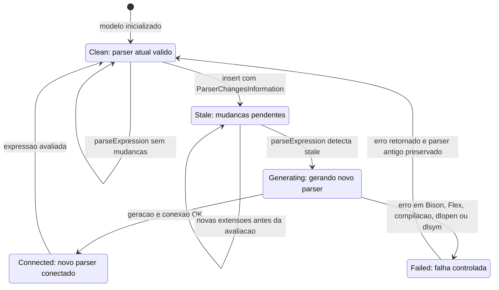

# Diagrama de Estados - Parser Dinamico

Este diagrama descreve os estados do parser ativo no modelo, incluindo o fluxo de erro em que o parser antigo permanece utilizavel.

```mermaid
stateDiagram-v2
    state "Clean: parser atual valido" as Clean
    state "Stale: mudancas pendentes" as Stale
    state "Generating: gerando novo parser" as Generating
    state "Connected: novo parser conectado" as Connected
    state "Failed: falha controlada" as Failed

    [*] --> Clean: modelo inicializado

    Clean --> Stale: insert com ParserChangesInformation
    Stale --> Generating: parseExpression detecta stale

    Generating --> Connected: geracao e conexao OK
    Connected --> Clean: expressao avaliada

    Generating --> Failed: erro em Bison, Flex, compilacao, dlopen ou dlsym
    Failed --> Clean: erro retornado e parser antigo preservado

    Clean --> Clean: parseExpression sem mudancas
    Stale --> Stale: novas extensoes antes da avaliacao
```
