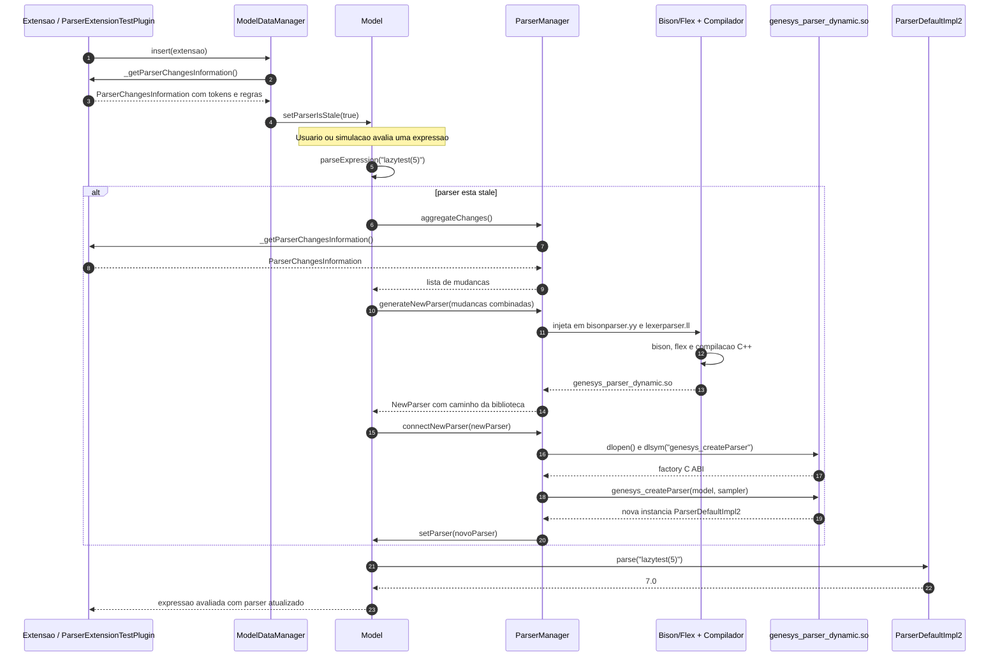

# Diagrama de Sequencia - Lazy Reload do Parser

Este diagrama apresenta o caso de uso principal: uma extensao contribui mudancas ao parser, o modelo fica marcado como stale e a primeira chamada a `parseExpression()` regenera e conecta o parser automaticamente.

