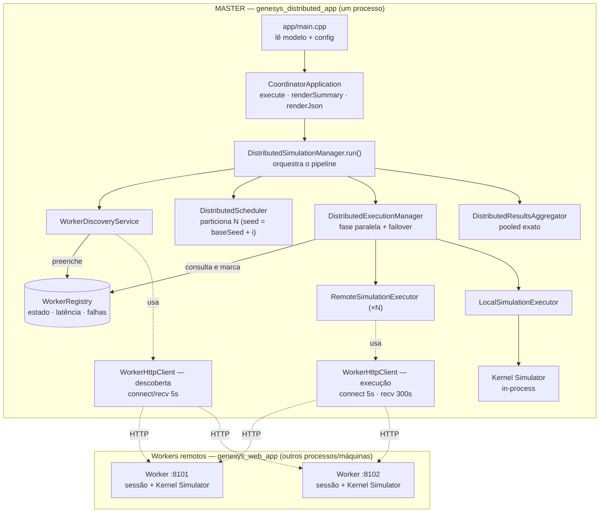
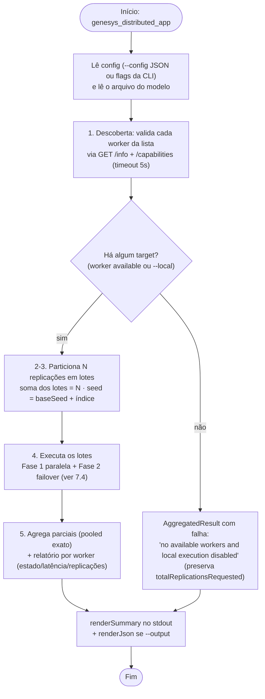
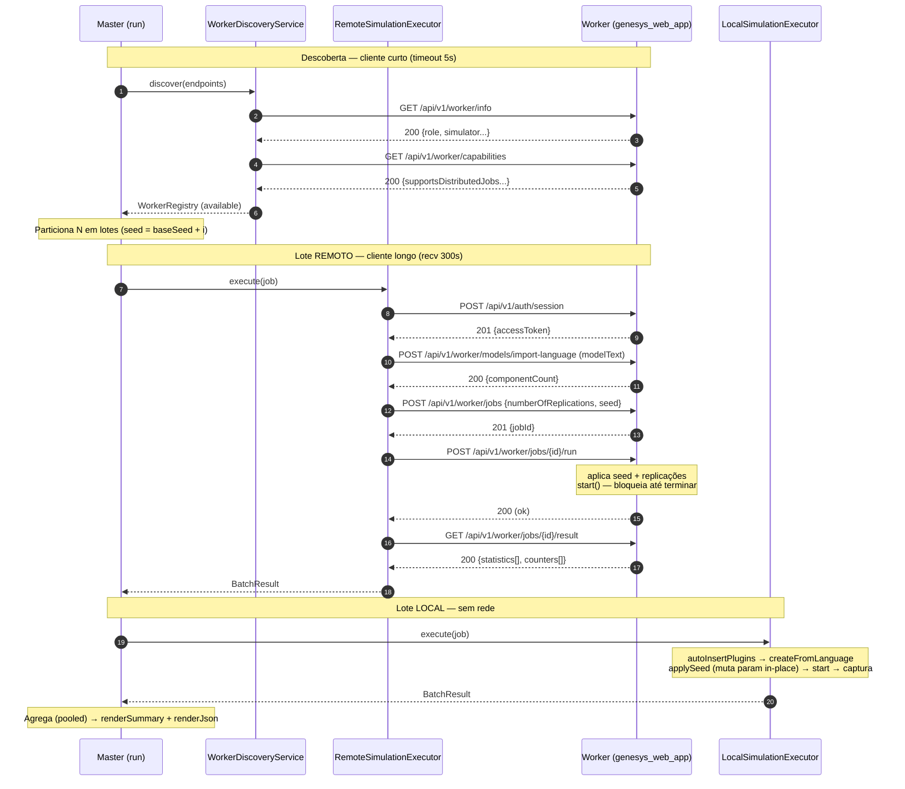
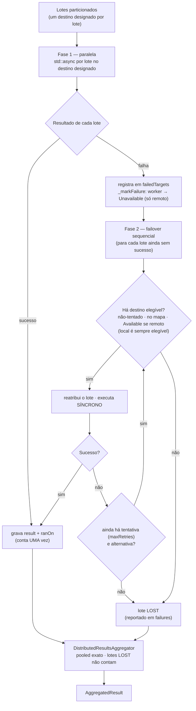
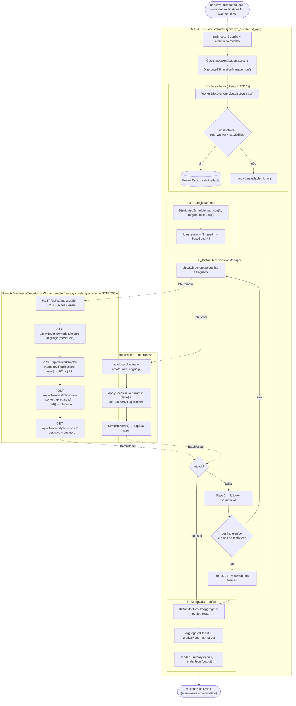

# Parte 7 — Diagramas do funcionamento da camada distribuída

Quatro diagramas Mermaid complementares: **(1)** arquitetura de componentes, **(2)** fluxo
ponta-a-ponta do orquestrador, **(3)** ciclo HTTP master↔worker (sequência) e **(4)** a lógica de
execução com failover. Renderizam no GitHub, no VS Code (extensão Mermaid) e em <https://mermaid.live>.

---

## 7.1. Arquitetura de componentes

Quem fala com quem. O **master** (`genesys_distributed_app`) orquestra; os **workers**
(`genesys_web_app`) executam lotes via HTTP; o **executor local** roda um `Simulator` no próprio
processo. Há **dois** clientes HTTP com timeouts distintos (descoberta rápida vs. execução longa).

As setas **sólidas** são relações de uso/composição (quem cria/chama quem); as **pontilhadas** são
uso do cliente HTTP, chamadas HTTP aos workers e a execução in-process. A ordem temporal está em 7.2.

---

## 7.2. Fluxo ponta-a-ponta (orquestrador)

Os 5 passos de `DistributedSimulationManager.run()`, com os dois caminhos de borda (nenhum target
disponível; lotes perdidos não impedem a agregação dos demais).

---

## 7.3. Ciclo HTTP master ↔ worker (sequência)

O ciclo de vida de um job. A descoberta usa o cliente curto; cada lote remoto usa o cliente longo
(o `POST /run` bloqueia até a simulação terminar). O lote local segue o **mesmíssimo** mecanismo de
seed, mas in-process.

---

## 7.4. Execução com retry e failover (AC-06)

Duas fases no `DistributedExecutionManager`: tentativa inicial **paralela**, depois **failover
sequencial** dos lotes que falharam. Garantia central: **um lote bem-sucedido conta uma única vez**;
lotes sem alternativa viram `lost` e não corrompem a agregação.

---

## 7.5. Diagrama único — visão geral completa

Tudo num só fluxograma: da CLI à descoberta, particionamento, dispatch para os dois tipos de
executor (remoto via HTTP e local in-process), failover e agregação final. As setas pontilhadas são
chamadas/retornos entre o orquestrador e os executores.

---